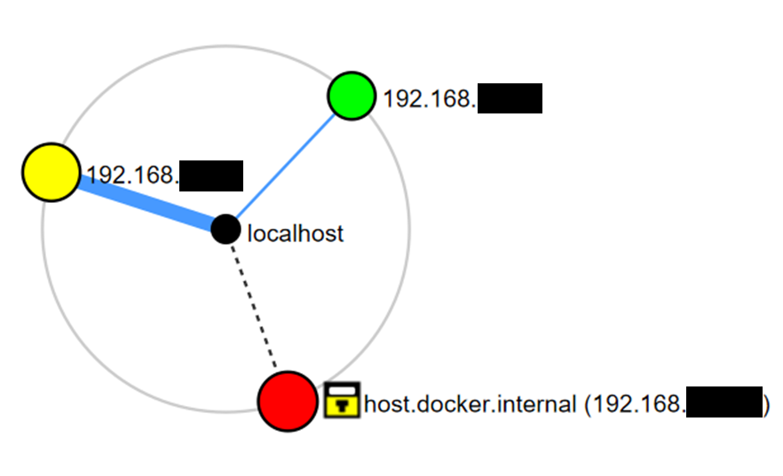
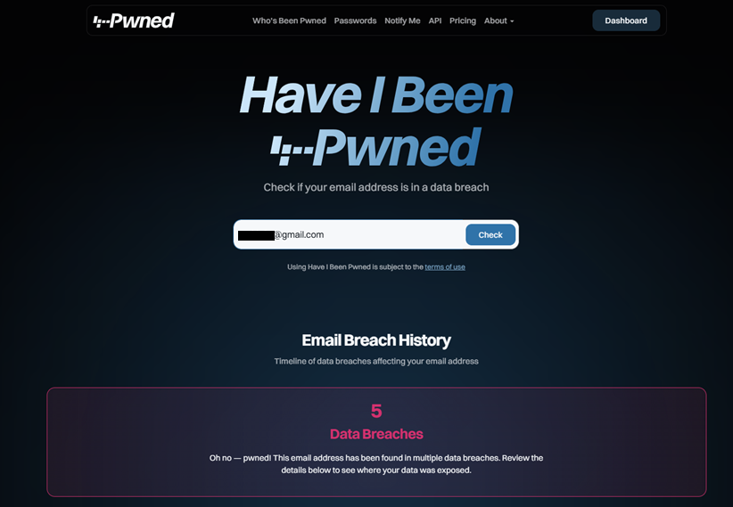

# Security Engineering Exercises - Week 1

## Task 1

**Q1:** Write a short description of the actions you have done to fortify your defenses towards all sorts of cyber crimes, including possible servers and accounts you have.  
**A1:** Here is a list of actions I have done to fortify my defenses against all sorts of cyber crimes:  
- I keep all systems and software up to date.  
- For my accounts, I use password managers (KeePass on PC and Passwords on mobile) to create/use strong and unique credentials.  
- I enable multi-factor authentication wherever possible.  
- I apply regular backups (both online and offline) for all the important data.  
- I stay aware of newly emerging cyber threats to remain vigilant.  

**Q2:** Have you been a victim of cyber crimes and do you think you could have prevented them? For example phishing and malware attacks. What could you improve on?  
**A2:** Yes, when using my first ever VPS running on a cloud provider, I set the root password to one of the simplest passwords possible as I was thinking the VPS was only for educational use and not critical. Within 2 hours, I got an email from the cloud provider stating that there was some malicious network and port scanning activity on my VPS. I tried to log back in but the password had already been changed. I was shocked at how quickly the attacker(s) compromised my VPS and then locked me out of it. This could have been easily prevented by using a stronger password.  

## Task 4A:

**Q1:** Did you find devices you did not know were in your network?  
**A1:** No.

**Q2:** Were there open ports which should have been closed?  
**A2:** No.

**Q3:** Did nmap find any vulnerabilities with the scripts?  
**A3:** Yes. For the host 192.168.XX.XX, it seems that message signing for Server Message Block (SMB) protocol is supported, but it isn’t enforced which is less secure.
Host script results:
| smb2-time: 
|   date: 2025-09-14T20:00:51
|_  start_date: N/A
| smb2-security-mode: 
|   3.1.1: 
|_    Message signing enabled but not required

**Q4:** Screenshot of the topology of your network. You can redact device information if you want.  
**A4:**  

## Task 4B:

**Q1:** Has your account details leaked?  
**A1:** Yes.

**Q2:** Screenshot of haveibeenpwned search, you can redact information if you want.  
**A2:**  

**Q3:** Did you change passwords and/or email + password combos, that were leaked, if not, do it.  
**A3:** Yes, I changed them.

